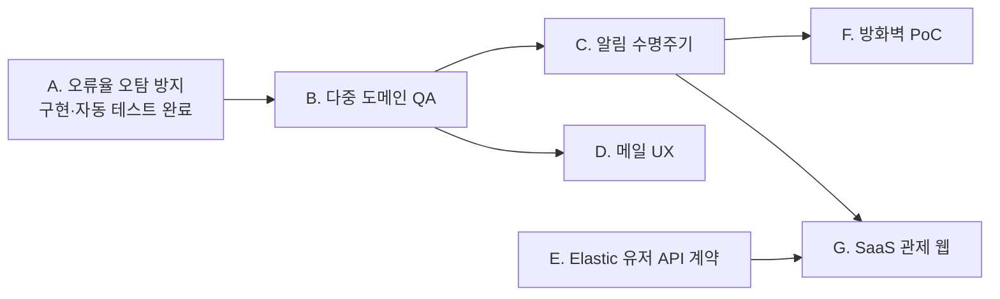

# 모니터링 시스템 후속 개발 계획

| 항목 | 내용 |
|------|------|
| 기준 | [2026-07-06 회의](meeting-notes/2026-07-06-monitoring-system.md), [2026-07-11 오류·기능개선 사항](feedback/2026-07-11-error-and-feature-improvements.md) |
| 상태 | 파트 분담 전 |
| 마지막 갱신 | 2026-07-13 |
| 상위 스펙 | [모니터링 시스템 통합 스펙](monitoring-system-specification.md) |

## 진행 원칙

- 오류율 오탐 방지의 설정·공통 판정·자동 테스트는 완료했다. 이어서 실서버 P0 회귀 QA와 도메인 정보 격리를 완료한다.
- 확정되지 않은 Elastic 유저 API, 방화벽, SaaS 기술 선택은 담당자가 사양과 수용 기준을 제안한 뒤 구현한다.
- 작업자는 관련 요구사항 ID와 테스트 또는 실제 QA 증적을 PR에 연결한다.
- 파트는 투표로 지원받고 다음 회의에서 책임자와 목표 일정을 확정한다.

## 작업 묶음

| 묶음 | 우선순위 | 범위 | 선행 조건 | 산출물 | 담당 |
|------|----------|------|-----------|--------|------|
| A. 오류율 오탐 방지 | P0 | 4xx·5xx 최소 요청 수, 공통 판정, 경계값·도메인별 회귀 | 기본값 20·개별 환경 변수 확정 | 설정·판정 구현과 자동 테스트 완료, 실서버 QA 증적 남음 | 구현 완료·QA 투표 |
| B. 다중 도메인 QA | P0 | 브루트포스 독립 집계, 수신자별 메일 본문 격리, DDoS 도메인 표시 | 테스트 도메인·수신자 | 회귀 테스트, 재현 증적, 수정 PR | 투표 |
| C. 알림 수명주기 | P0 | 사건 키, 상관 정책, cooldown, 폴링·Job 장애 격리 | 중복 정책 결정 | 설계 기록, 자동 테스트, 수정 PR | 투표 |
| D. 메일 UX | P1 | HTML·plain-text MIME, 정보 구조, 동적 값 이스케이프, SMTP·Resend 비교 | B의 수신자별 본문 | 템플릿 시안, 렌더·발송 증적, 기술 결정 | 투표 |
| E. Elastic 유저 API | P1 | 후보 계약 검증, role 정규화·충돌, 사용자-도메인 정본, 캐시·장애 정책 | API 담당자·운영 응답 확인 | 계약 문서, 샘플·계약 테스트 | 투표 |
| F. 방화벽 PoC | P1 | dry-run, allowlist, 승인·해제·감사 | 대상 제품·권한 결정 | 안전성 설계, 격리 환경 PoC | 투표 |
| G. SaaS 관제 웹 | P2 | 인증, 대상 등록·승인, 권한별 읽기 화면 | MVP 승인·권한 모델 | 3~4주 PoC/MVP | 투표 |

## 권장 순서

Elastic 유저 API가 SaaS MVP에 반드시 필요한지는 계약 조사 후 결정한다. 정적 또는 별도 애플리케이션 권한 모델로 MVP를 검증할 수 있다면 E와 G를 불필요하게 결합하지 않는다.

## 확정 사항

- 4xx는 `WEB_ERROR_MIN_REQUESTS`, 5xx는 `SERVER_ERROR_MIN_REQUESTS`로 별도 설정하며 기본값은 각각 20이다.
- Job 탐지와 최종 알림 변환은 요청 수 하한과 오류율 임계값을 함께 검사하는 공통 판정을 사용한다.
- 저표본·경계값·도메인별 독립 적용 자동 테스트는 통과했으며 실서버·SMTP QA 증적은 후속으로 남긴다.

## 다음 회의 결정 안건

- [ ] 브루트포스와 4xx 중복 알림 표현 방식
- [ ] 오류율 하한선의 실서버·SMTP 회귀 QA 담당자와 일정
- [ ] 사건 cooldown과 재통지 조건
- [ ] 다중 도메인 DDoS의 사용자 노출 방식
- [ ] Elastic 유저 API 후보 계약, 최소 권한, role 정규화·충돌, 장애 시 fallback
- [ ] 메일 형식 시안, 언어·필수 필드, 기존 SMTP 또는 Resend 선택
- [ ] 방화벽 제품, 승인 방식, TTL, 안전 예외
- [ ] 3~4주 범위에서 SaaS MVP 또는 방화벽 PoC 중 우선 결과물
- [ ] 각 작업 묶음 담당자와 일정

## 완료 정의

- 기능 구현과 관련 자동 테스트가 통과한다.
- 실제 환경이 필요한 항목은 비밀정보를 제거한 QA 증적이 있다.
- 요구사항 문서의 상태와 구현 위치가 갱신된다.
- 도메인 권한 경계를 침범하는 테스트가 통과한다.
- 운영 롤백 또는 장애 대응 절차가 문서화된다.
