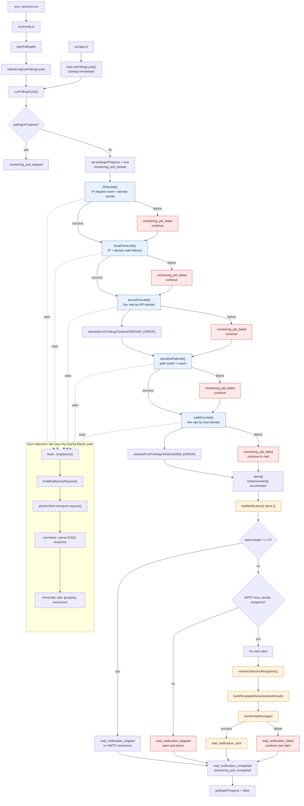
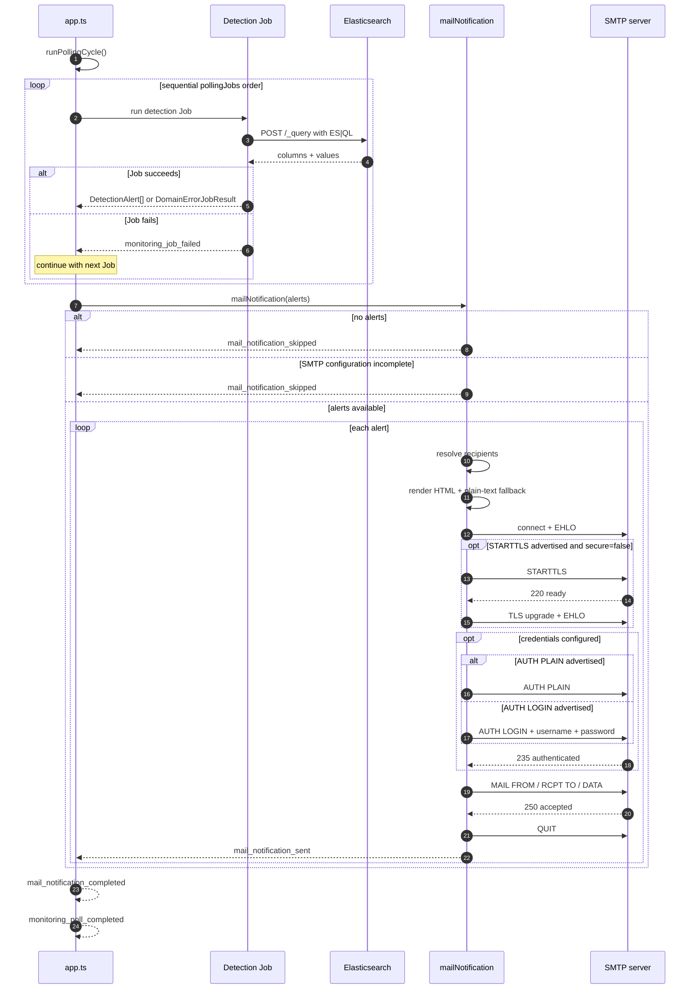

# Monitoring Job Structure

현재 `src/app.ts` 기준의 폴링, 탐지 Job, 메일 발송 흐름이다.

## Component Flow



## SMTP Sequence



## Execution Order

```text
startup or interval
  -> DDosJob
  -> bruteForceJob
  -> serverErrorJob
  -> sensitivePathJob
  -> webErrorJob
  -> alerts aggregation
  -> mailNotification
  -> next interval
```

개별 Job 실패는 `monitoring_job_failed`로 기록하고 다음 Job을 계속 실행한다. 메일 발송 실패도 다음 alert 처리를 막지 않는다.
