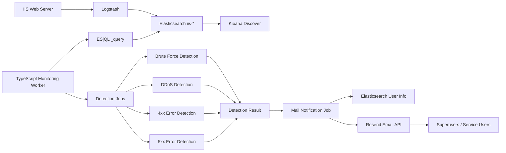
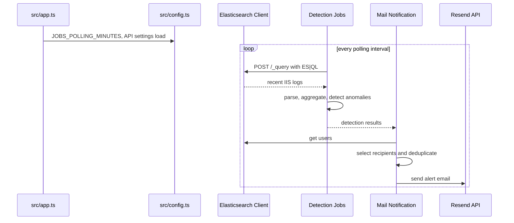
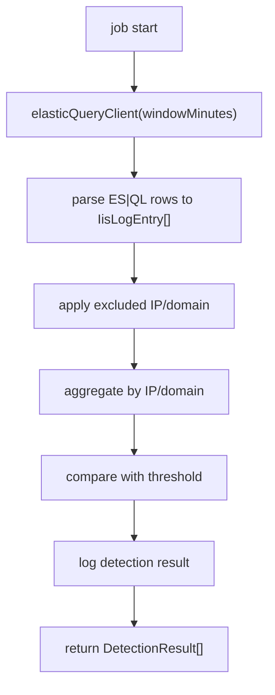
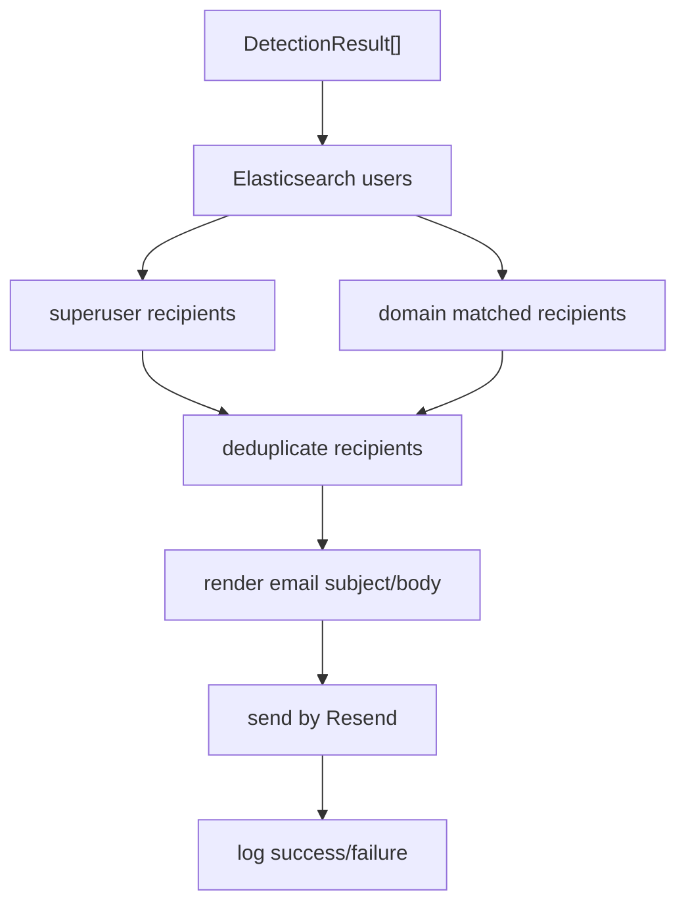
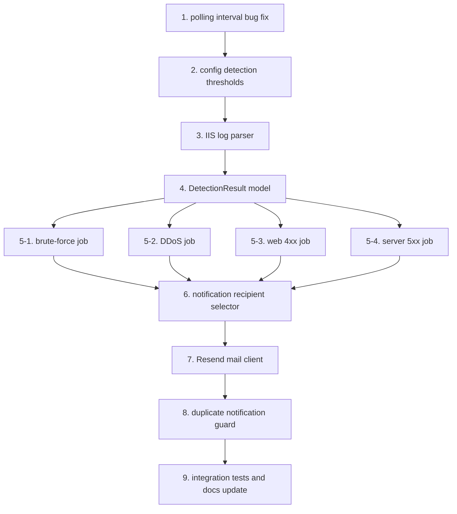

# 관제 시스템 개발 가이드

이 문서는 IIS 웹 로그 관제 시스템의 목표 구조와 앞으로 구현해야 할 코드 단위를 한눈에 보기 위한 개발 가이드다. 상세 요구사항은 `Docs/requirements/*.md`를 기준으로 관리하고, 이 문서는 개발자가 구현 순서와 코드 책임을 빠르게 파악하는 용도로 사용한다.

## 목표 시스템

이 프로젝트는 공격을 수행하는 도구가 아니라, Elasticsearch에 적재된 IIS 웹 로그를 주기적으로 조회해서 공격 또는 장애 징후를 탐지하고 이메일로 알리는 관제 워커다.



## 런타임 흐름

`src/app.ts`는 웹 서버가 아니라 주기 실행 프로세스다. 실행되면 `.env`를 로드하고, 설정된 간격마다 탐지 job과 알림 job을 순서대로 실행한다.



## 코드 책임

| 영역 | 파일 | 책임 | 현재 상태 |
| --- | --- | --- | --- |
| 실행 진입점 | `src/app.ts` | 주기적으로 job 실행 | 구조 있음. polling minutes를 milliseconds로 변환하는 보정 필요 |
| 설정 | `src/config.ts` | 환경 변수와 탐지 기준 제공 | API 설정 있음. 탐지 임계값/예외 목록 추가 필요 |
| Elasticsearch 연결 | `src/utils/elastic.client.ts` | 공식 Elasticsearch 클라이언트 생성 | 구현됨 |
| ES|QL 조회 | `src/utils/elastic-query.client.ts` | 최근 IIS 로그 조회 | 구현됨. 내부 로그 모델 파싱 추가 필요 |
| 사용자 조회 | `src/utils/elastic-user.client.ts` | Elasticsearch 사용자 정보 조회 | 기본 호출 구현됨. 알림 대상 모델 변환 필요 |
| 로깅 | `src/utils/logger.ts` | ECS 형식 JSON 로그 출력 | 구현됨 |
| 로컬 세팅 | `src/setup/*` | index template, Kibana data view 생성 | 구현됨 |
| 탐지 job | `src/jobs/*.job/job.ts` | 공격/장애 징후 탐지 | 스텁 상태 |
| 메일 job | `src/jobs/mail-notification.job/job.ts` | 탐지 결과 이메일 발송 | 스텁 상태 |

## 구현해야 할 코드 단위

### 1. 공통 로그 모델

Elasticsearch ES|QL 응답은 job별 탐지 로직이 직접 다루지 않도록 내부 모델로 변환한다.

```ts
export type IisLogEntry = {
    timestamp: string;
    clientIp: string;
    domain?: string;
    method?: string;
    path?: string;
    statusCode: number;
    timeTaken?: number;
    userAgent?: string;
};
```

필요 코드:

| 파일 | 구현 내용 |
| --- | --- |
| `src/utils/iis-log.parser.ts` | ES|QL `columns` / `values` 응답을 `IisLogEntry[]`로 변환 |
| `tests/iis-log.parser.test.ts` | 필드 매핑, 누락 필드, status number 변환 테스트 |

### 2. 탐지 결과 모델

모든 탐지 job은 서로 다른 판단 기준을 사용하지만, 알림 job으로 넘기는 결과는 하나의 구조로 맞춘다.

```ts
export type DetectionResult = {
    type: 'BRUTE_FORCE' | 'DDOS' | 'WEB_4XX' | 'SERVER_5XX';
    target: {
        ip?: string;
        domain?: string;
    };
    count: number;
    ratio?: number;
    threshold: string;
    reason: string;
    detectedAt: string;
};
```

필요 코드:

| 파일 | 구현 내용 |
| --- | --- |
| `src/jobs/detection-result.ts` | 공통 탐지 결과 타입과 helper |
| `tests/detection-result.test.ts` | 결과 생성 helper 테스트 |

### 3. 탐지 기준 설정

현재 `src/config.ts`는 API 설정 중심이다. 탐지 시간 범위, 임계값, 예외 IP/domain을 config로 분리해야 한다.

```ts
export const config = {
    detection: {
        windowMinutes: 5,
        bruteForce: {
            failureThreshold: 10,
            excludedIps: []
        },
        ddos: {
            requestThreshold: 100,
            excludedIps: []
        },
        webError: {
            countThreshold: 20,
            ratioThreshold: 0.3,
            excludedDomains: []
        },
        serverError: {
            countThreshold: 5,
            ratioThreshold: 0.1,
            excludedDomains: []
        }
    }
};
```

필요 코드:

| 파일 | 구현 내용 |
| --- | --- |
| `src/config.ts` | 탐지 기준과 예외 목록 추가 |
| `.env.example` | 운영자가 조정할 환경 변수 추가 |
| `tests/config.test.ts` | 기본값과 env override 테스트 |

### 4. 탐지 job

각 job은 다음 공통 패턴을 따른다.



| 파일 | 구현 기준 |
| --- | --- |
| `src/jobs/brute-force.job/job.ts` | `path`에 `login` 또는 `auth`가 포함되고 status가 400/401/403인 요청을 `clientIp + domain` 기준으로 집계 |
| `src/jobs/DDos.job/job.ts` | 전체 요청을 `clientIp + domain` 기준으로 집계해 임계 요청 수 이상 탐지 |
| `src/jobs/web-error.job/job.ts` | domain별 전체 요청 대비 4xx count와 ratio가 모두 기준 이상이면 탐지 |
| `src/jobs/server-error.job/job.ts` | domain별 전체 요청 대비 5xx count와 ratio가 모두 기준 이상이면 탐지 |

각 job 테스트는 최소 세 가지를 포함한다.

| 테스트 | 의미 |
| --- | --- |
| 정상 탐지 | 임계값 이상일 때 `DetectionResult[]` 반환 |
| 미탐지 | 임계값 미만일 때 빈 배열 반환 |
| 예외 처리 | excluded IP/domain은 탐지 대상에서 제외 |

### 5. 메일 알림 job

메일 알림은 탐지 job과 분리한다. 탐지 job은 결과만 반환하고, 메일 job이 수신자 선정과 발송을 담당한다.



필요 코드:

| 파일 | 구현 내용 |
| --- | --- |
| `src/jobs/mail-notification.job/job.ts` | 탐지 결과를 받아 메일 발송 |
| `src/utils/notification-recipient.selector.ts` | superuser, domain 사용자, 이메일 누락 사용자 처리 |
| `src/utils/resend.client.ts` | Resend API 호출 |
| `src/utils/notification-deduplicator.ts` | 짧은 시간 내 동일 탐지 결과 중복 발송 방지 |
| `tests/notification-recipient.selector.test.ts` | 수신자 선정 테스트 |
| `tests/mail-notification.test.ts` | 메일 본문 생성과 발송 호출 테스트 |

## 권장 개발 순서



## 개발 완료 기준

각 기능은 다음 조건을 만족해야 완료로 본다.

| 기준 | 설명 |
| --- | --- |
| 타입 체크 | `npm run check` 통과 |
| 단위 테스트 | `npm test` 통과 |
| 요구사항 문서 갱신 | `Docs/requirements-definition.md` 상태와 비고 갱신 |
| 로깅 | 실패와 탐지 결과가 ECS 로그로 남음 |
| 설정 분리 | 임계값과 예외 목록이 코드에 하드코딩되지 않음 |
| 알림 안전성 | 이메일 누락, 중복 알림, 예외 IP/domain 처리 테스트 포함 |

## 제외 범위

다음 항목은 현재 1차 개발 범위가 아니다.

| 항목 | 이유 |
| --- | --- |
| 공격 트래픽 생성 | 이 프로젝트는 방어/관제 시스템이며 공격 수행 도구가 아니다 |
| 운영용 reverse proxy 설계 | `Docs/elk-local-environment.md`에서 별도 범위로 제외됨 |
| 방화벽 자동 차단 | 요구사항상 2차 개발 범위 |
| 웹 UI 대시보드 개발 | 현재 구조는 TypeScript 백그라운드 워커 중심 |
