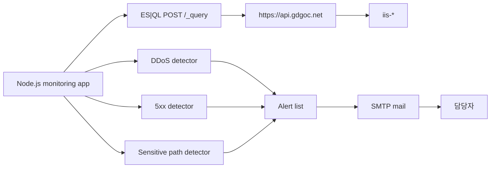

# IIS 웹 로그 모니터링 개발 가이드

## 목표

외부 Elasticsearch API에 적재된 IIS 웹 로그를 실시간에 가깝게 조회하여 장애와 보안 위협을 탐지하고, 이상 발생 시 SMTP로 담당자에게 즉시 알림 메일을 발송한다.

## 개발 환경 원칙

- Native Windows 실행을 우선한다.
- WSL은 지원하지 않는다. 추후 방화벽 CLI 호출 연동을 고려한 제약이다.
- 로컬 Elasticsearch, Kibana, Logstash, Docker Compose 환경은 사용하지 않는다.
- Elasticsearch는 `https://api.gdgoc.net/` API를 Basic Auth로 호출한다.
- 대상 데이터는 `iis-*` 인덱스이다.

## 런타임 흐름

## 필수 탐지 시나리오

| 시나리오 | 구현 기준 | 설정 |
|----------|-----------|------|
| DDoS 의심 | 최근 조회 구간에서 동일 `c_ip` 요청 수가 기준 이상이면 탐지 | `DDOS_REQUESTS_PER_IP` |
| 서비스 장애 | 최근 조회 구간에서 `sc_status`가 500 이상 600 미만인 응답 수가 기준 이상이면 탐지 | `SERVER_ERROR_COUNT` |
| 보안 위협 | 최근 조회 구간에서 `cs_uri_stem`이 민감 경로 목록과 일치하면 탐지 | `SENSITIVE_PATHS` |

조회 구간은 `DETECTION_WINDOW_MINUTES`, 실행 주기는 `JOBS_POLLING_MINUTES`로 조정한다.

## 코드 작성 규칙

- 탐지 job은 `src/jobs/*/job.ts`에 둔다.
- 현재 코드는 구현 전 스텁 상태를 유지한다.
- 실제 탐지 로직과 SMTP 발송 로직은 별도 승인 후 구현한다.
- Elasticsearch 요청 payload 구성은 `src/utils/elastic-query.client.ts`에 둔다.
- 인증 정보, 임계값, 수신자 정보는 `.env`에서만 관리한다.
- 소스 코드에 계정, 비밀번호, 메일 주소 실값을 넣지 않는다.

## 실행 절차

1. `.env.example`을 `.env`로 복사한다.
2. Elastic Basic Auth 계정과 SMTP 정보를 입력한다.
3. `npm install`로 의존성을 설치한다.
4. Windows에서는 `npm run dev:win`, 공통 환경에서는 `npm run dev`를 실행한다.
5. 변경 전후 `npm run check`와 `npm test`를 실행한다.

## API 참고

- ES\|QL 문법: <https://www.elastic.co/docs/reference/query-languages/esql>
- Elasticsearch Query API: <https://www.elastic.co/docs/api/doc/elasticsearch/group/endpoint-query>
