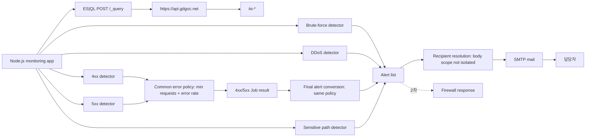

# IIS 웹 로그 모니터링 개발 가이드

## 목표

외부 Elasticsearch API에 적재된 IIS 웹 로그를 주기적으로 조회하여 장애와 보안 위협을 탐지하고, 탐지 결과가 있으면 해당 폴링이 끝난 뒤 SMTP로 권한 있는 담당자에게 알림 메일을 발송한다.

## 개발 환경 원칙

- Native Windows 실행을 우선한다.
- WSL은 현재 지원하지 않는다. 방화벽 CLI/API 계약과 실행 호스트가 확정되면 지원 범위를 다시 검토한다.
- 로컬 Elasticsearch, Kibana, Logstash, Docker Compose 환경은 사용하지 않는다.
- Elasticsearch는 `https://api.gdgoc.net/` API를 Basic Auth로 호출한다.
- 대상 데이터는 `iis-*` 인덱스이다.

## 런타임 흐름

```mermaid
flowchart LR
    App["Node.js monitoring app"] --> Query["ES|QL POST /_query"]
    Query --> Api["https://api.gdgoc.net"]
    Api --> Index["iis-*"]
    App --> Brute["Brute-force detector"]
    App --> Ddos["DDoS detector"]
    App --> WebErrors["4xx detector"]
    App --> ServerErrors["5xx detector"]
    App --> Paths["Sensitive path detector"]
    Brute --> Alert["Alert list"]
    Ddos --> Alert["Alert list"]
    WebErrors --> ErrorPolicy["Common error policy: min requests + error rate"]
    ServerErrors --> ErrorPolicy
    ErrorPolicy --> ErrorResult["4xx/5xx Job result"]
    ErrorResult --> FinalPolicy["Final alert conversion: same policy"]
    FinalPolicy --> Alert
    Paths --> Alert
    Alert --> Scope["Recipient resolution: body scope not isolated"]
    Scope --> Smtp["SMTP mail"]
    Smtp --> Recipients["담당자"]
    Alert -. "2차" .-> Firewall["Firewall response"]
```

기본 실행 주기는 1분이고 조회 창은 최근 5분이다. 로그 발생부터 메일 도착까지는 다음 폴링 대기, Elastic 조회, SMTP 처리 시간이 포함된다.

## 필수 탐지 시나리오

| 시나리오 | 구현 기준 | 설정 |
|----------|-----------|------|
| 무차별 대입 탐지 | 최근 조회 구간에서 인증 관련 요청의 설정된 실패 상태를 `clientIp + hostDomain`별로 집계해 임계값 이상이면 탐지 | `BRUTE_FORCE_MAX_FAILURES`, `BRUTE_FORCE_TARGET_PATHS`, `BRUTE_FORCE_STATUS_CODES`, `BRUTE_FORCE_EXCLUDED_IPS` |
| DDoS 의심 탐지 | 동일 `clientIp`의 전체 요청 수가 기준 이상이면 탐지하고 `hostDomain`별 요청 수도 함께 보존 | `DDOS_REQUESTS_PER_IP`, `DDOS_EXCLUDED_IPS` |
| 웹 서비스 오류 탐지 | `hostDomain`별 최소 요청 수(기본 20)를 충족하고 HTTP 4xx 응답 비율이 기준 이상이면 탐지 | `WEB_ERROR_RATE_PERCENT`, `WEB_ERROR_MIN_REQUESTS`, `EXCLUDED_DOMAINS` |
| 서버 오류 탐지 | `/api[/v1]/{segment}`의 첫 세그먼트인 `apiDomain`별 최소 요청 수(기본 20)를 충족하고 HTTP 5xx 비율이 기준 이상이면 탐지 | `SERVER_ERROR_RATE_PERCENT`, `SERVER_ERROR_MIN_REQUESTS`, `EXCLUDED_DOMAINS` |
| 민감 경로 탐지 | `path`가 민감 경로 목록과 일치하거나 하위 경로이면 `clientIp + hostDomain + path`별로 탐지 | `SENSITIVE_PATHS` |

조회 구간은 `DETECTION_WINDOW_MINUTES`, 실행 주기는 `JOBS_POLLING_MINUTES`로 조정한다.

두 최소 요청 수 설정은 2026-07-13 구현되었다. `WEB_ERROR_MIN_REQUESTS`와 `SERVER_ERROR_MIN_REQUESTS`는 각각 기본값 `20`을 사용하며 독립적으로 변경할 수 있다. `src/utils/domain-error-detection.ts`의 공통 판정은 탐지 Job의 `detected`·경고 로그와 `src/app.ts`의 최종 alert 변환에 함께 적용된다. 전체 집계 결과는 관측을 위해 반환하되 최소 요청 수 미만 항목은 오류 경고나 메일 alert로 변환하지 않는다.

`GAP-008`은 2026-07-13 타입 검사와 자동 테스트 38건 통과를 기준으로 해결 처리했다. 외부 Elasticsearch·SMTP를 사용한 실서버 QA는 아직 완료되지 않았다.

## 현재 안정화 과제

- 브루트포스는 도메인별로 집계하지만 다중 도메인 동시 발생 회귀 테스트가 필요하다.
- 웹·서버 오류의 최소 요청 수 정책은 자동 테스트까지 완료했지만 실서버 트래픽과 SMTP 메일을 연결한 QA가 필요하다.
- 현재 메일 로직은 도메인 수신자를 선정한 뒤 같은 폴링의 전체 알림 본문을 공유할 수 있어, 수신자별 본문 필터링이 필요하다.
- 현재 메일은 plain text만 지원한다. HTML과 plain-text 대체 본문을 함께 제공하고 동적 값을 이스케이프해야 한다.
- 현재 수신자 매핑은 환경 변수 기반이다. PDF에 제시된 `GET /_security/user` 계약과 role 기반 라우팅은 실제 API 검증 후 구현한다.
- DDoS의 도메인별 요청 수가 기본 메일 본문에 표시되지 않는다.
- 브루트포스 인증 실패와 웹 오류 4xx의 사건 상관·중복 억제 정책이 미결정이다.
- 반복 조회 창에 대한 cooldown, Job별 장애 격리, 비동기 폴링 중첩 방지가 미구현이다.
- 서버 오류의 `apiDomain`과 요청 호스트 `hostDomain`을 데이터 계약에서 분리해야 한다.

구현 전후 상세 기준은 [알림 수명주기 요구사항](requirements/alert-lifecycle.md)과 [회귀 QA 계획](test-plans/2026-07-06-detection-regression.md)을 따른다.

## 코드 작성 규칙

- 탐지 job은 `src/jobs/*/job.ts`에 둔다.
- Elasticsearch 요청 payload 구성은 `src/utils/elastic-query.client.ts`에 둔다.
- 4xx·5xx의 최소 요청 수와 오류율 판정은 `src/utils/domain-error-detection.ts`의 공통 정책을 사용하고, 최종 alert 변환에서도 같은 정책을 재검증한다.
- 인증 정보와 현재 정적 수신자 매핑은 `.env`에서 관리한다. 목표 사용자 권한은 검증된 Elastic 사용자 API에서 조회한다.
- 소스 코드에 계정, 비밀번호, 메일 주소 실값을 넣지 않는다.
- `hostDomain`과 `apiDomain`을 신규 코드에서 같은 의미의 `domain`으로 혼용하지 않는다.
- 사용자별 본문은 권한 필터링을 끝낸 뒤 생성한다.
- HTML 메일의 동적 값은 이스케이프하고 plain-text 대체 본문을 유지한다.
- 사용자 API 장애 시 서비스 사용자에게 잘못된 범위의 메일을 보내는 방식으로 우회하지 않는다.
- 탐지 Job의 실패가 다른 Job과 이미 만들어진 알림을 중단시키지 않게 설계한다.

## 실행 절차

1. `.env.example`을 `.env`로 복사한다.
2. Elastic Basic Auth 계정과 SMTP 정보를 입력한다.
3. `npm install`로 의존성을 설치한다.
4. Windows에서는 `npm run dev:win`, 공통 환경에서는 `npm run dev`를 실행한다.
5. 변경 전후 `npm run check`와 `npm test`를 실행한다.

## API 참고

- [모니터링 시스템 통합 스펙](monitoring-system-specification.md)
- [요구사항 대시보드](requirements-definition.md)
- [2026-07-11 오류 및 기능개선 사항 반영 기록](feedback/2026-07-11-error-and-feature-improvements.md)
- ES\|QL 문법: <https://www.elastic.co/docs/reference/query-languages/esql>
- Elasticsearch Query API: <https://www.elastic.co/docs/api/doc/elasticsearch/group/endpoint-query>
