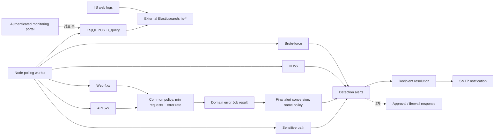

# 모니터링 시스템 통합 스펙

| 항목 | 내용 |
|------|------|
| 문서 상태 | 활성 |
| 기준 회의 | 2026-07-06 `[GDGoC] 모니터링 시스템` |
| 추가 피드백 | [2026-07-11 오류 및 기능개선 사항](feedback/2026-07-11-error-and-feature-improvements.md) |
| 마지막 갱신 | 2026-07-13 |
| 현재 구현 기준 | `7ad79f8` 기반 2026-07-13 작업 트리 |
| 상세 요구사항 | [요구사항 대시보드](requirements-definition.md) |
| 회의 출처 | [2026-07-06 회의 추적 기록](meeting-notes/2026-07-06-monitoring-system.md) |

## 1. 문서 목적

이 문서는 현재 동작하는 IIS 웹 로그 탐지 워커, 2026-07-06 회의에서 합의한 후속 개발 방향, 2026-07-11 오류·기능개선 피드백을 하나의 단계별 스펙으로 정리한다. 구현된 사실, QA가 필요한 항목, 다음 단계의 계획, 아직 결정되지 않은 제안을 구분해 과도한 구현 해석을 방지한다.

상세 수용 기준은 `Docs/requirements/` 문서를 따른다. 구현 상태가 문서와 다르면 코드는 현재 동작을 설명하는 근거이고, 요구사항 문서는 도달해야 할 목표로 취급한다.

## 2. 상태 정의

| 상태 | 의미 |
|------|------|
| 구현됨 | 현재 저장소에 코드와 기본 자동 테스트가 있다. |
| 부분 구현 | 핵심 경로는 있으나 요구사항 일부가 충족되지 않는다. |
| QA 필요 | 코드가 있으나 회의에서 오동작 가능성이 제기되어 실제 환경 또는 회귀 테스트가 필요하다. |
| 계획 | 후속 개발 방향으로 합의했으나 구현되지 않았다. |
| 검토 중 | 아이디어에는 공감했으나 범위·우선순위·기술 선택이 확정되지 않았다. |
| 결정 대기 | 필요성은 확인했지만 동작 규칙이나 계약을 다음 회의에서 정해야 한다. |
| 제외 | 현재 단계에서 의도적으로 다루지 않는다. |

## 3. 목표와 비범위

### 목표

- 외부 Elasticsearch의 IIS 로그를 주기적으로 조회해 보안 위협과 서비스 오류를 탐지한다.
- 탐지 결과를 공격 IP, 대상, 근거와 함께 권한 있는 담당자에게 알린다.
- 다중 도메인 환경에서 집계와 알림 데이터가 서로 섞이지 않도록 보장한다.
- 후속 단계에서 안전하고 되돌릴 수 있는 방화벽 대응 흐름을 제공한다.
- 사용자가 Elasticsearch에 직접 접근하지 않고도 자신의 모니터링 대상만 조회할 수 있는 관제 웹의 타당성을 검증한다.

### 현재 비범위

- 로컬 Docker Compose 기반 Elasticsearch, Kibana, Logstash 구성
- IIS 샘플 로그의 로컬 적재 파이프라인
- WSL 실행 지원
- 방화벽 종류와 운영 명령의 임의 확정
- SaaS 포털의 인증 공급자, UI 프레임워크, Kibana 임베드 방식의 임의 확정

## 4. 사용자와 권한

| 역할 | 현재 | 목표 권한 |
|------|------|-----------|
| 운영자(superuser) | `.env`의 `SMTP_TO` 수신자 | 전체 탐지 조회, 대상·사용자 관리, 차단 승인·해제, 감사 로그 조회 |
| 서비스 사용자 | `.env`의 `SMTP_DOMAIN_RECIPIENTS` 수신자 | Elastic 사용자 role 또는 승인된 매핑으로 허용된 `hostDomain`의 알림과 대시보드만 조회 |
| 미인증 사용자 | 해당 없음 | 관제 데이터 접근 불가 |

## 5. 용어

| 용어 | 정의 |
|------|------|
| `clientIp` | IIS 로그에 기록된 요청 출발 IP |
| `hostDomain` | IIS 로그의 `domain` 필드에 기록된 요청 대상 호스트 |
| `apiDomain` | `/api[/v1]/{segment}` 경로의 첫 세그먼트. 현재 5xx 집계에서만 사용 |
| 모니터링 대상 | 서비스 사용자가 소유 또는 운영하도록 승인된 서버 IP와 `hostDomain` 묶음 |
| 탐지 이벤트 | 개별 탐지 Job이 임계값 충족을 판단해 만든 결과 |
| 보안 사건 | 같은 원시 요청·IP·대상·시간 창에서 발생한 관련 탐지 이벤트를 상관 분석한 단위. 현재 미구현 |

현재 타입과 일부 문서는 `hostDomain`과 `apiDomain`을 모두 `domain`으로 표현한다. SaaS 권한과 알림 라우팅 구현 전에 두 개념을 데이터 계약에서 분리해야 한다.

## 6. 단계별 범위

| 단계 | 영역 | 상태 | 완료 조건 |
|------|------|------|-----------|
| 1차 | 외부 Elastic 조회, 탐지 5종, SMTP 알림 | 부분 구현 | 다중 도메인, 중복 알림, 배포 설정을 포함한 회귀 QA 통과 |
| 1.1 | 오류율 트래픽 하한선(구현), 알림 수신 범위 격리, 사건 상관·중복 억제, 메일 가독성, Elastic 사용자 연동, Job 장애 격리 | 부분 구현 | [4xx](requirements/web-error.md), [5xx](requirements/server-error.md), [메일](requirements/mail-notification.md), [Elastic 사용자](requirements/elastic-user-api.md), [알림 수명주기](requirements/alert-lifecycle.md) 요구사항과 [회귀 QA 계획](test-plans/2026-07-06-detection-regression.md) 충족 |
| 2차 | 탐지 IP의 방화벽 등록·해제·감사 | 계획 | dry-run과 승인형 운영을 거쳐 되돌릴 수 있는 차단 수행 |
| 2차 검토 | 로그인, IP·도메인 등록, 권한별 대시보드 | 검토 중 | 3~4주 범위의 PoC/MVP 목표와 데이터 격리 방식 승인 |

## 7. 현재 런타임

기본 폴링 주기는 1분이고 기본 조회 창은 최근 5분이다. 따라서 알림은 로그 발생 즉시가 아니라 다음 정상 폴링과 메일 발송이 완료된 뒤 도착한다.

## 8. 현재 탐지 계약

| 탐지 | 집계 키 | 기본 기준 | 결과의 대상 범위 | 상태 |
|------|---------|-----------|------------------|------|
| 브루트포스 | `clientIp + hostDomain` | 인증 경로, 400/401/403, 30회 이상 | 단일 `hostDomain` | QA 필요 |
| DDoS | `clientIp` 전체 + `hostDomain`별 부가 집계 | 300회 이상 | 여러 `hostDomain` 가능 | 부분 구현 |
| 웹 오류 | `hostDomain` | 요청 20건 이상이고 4xx 비율 10% 이상 | 단일 `hostDomain` | QA 필요 |
| 서버 오류 | `apiDomain` | API 경로 요청 20건 이상이고 5xx 비율 5% 이상 | `hostDomain`을 보존하지 않음 | QA 필요 |
| 민감 경로 | `clientIp + hostDomain + path + matchedPath` | 설정 경로와 일치 또는 하위 경로 | 로그에 존재할 때 단일 `hostDomain` | 부분 구현 |

표의 값은 코드 기본값이다. 4xx 최소 요청 수는 `WEB_ERROR_MIN_REQUESTS`, 5xx 최소 요청 수는 `SERVER_ERROR_MIN_REQUESTS`로 각각 변경할 수 있다. 실제 배포 값은 환경 변수로 변경할 수 있으며 시연의 4,751건을 제품 임계값으로 사용하지 않는다.

## 9. 확인된 구현 차이와 위험

| ID | 내용 | 영향 | 우선순위 |
|----|------|------|----------|
| GAP-001 | 도메인 수신자는 자신과 일치하는 알림이 하나라도 있으면 선정되지만, 선정된 모든 수신자에게 해당 폴링의 전체 알림 본문을 보낸다. | 타 도메인 정보 노출 가능 | P0 |
| GAP-002 | DDoS의 `domainCounts`는 기본 메일 본문과 도메인 수신자 판정에 사용되지 않는다. | 시연 결과와 코드 불일치, 사용자 알림 누락 | P0 |
| GAP-003 | 인증 4xx가 브루트포스와 웹 오류에 각각 집계되며 사건 상관·중복 억제 정책이 없다. | 중복 또는 혼재 알림 | P0 |
| GAP-004 | 1분 폴링이 최근 5분을 반복 조회하지만 탐지 상태와 cooldown이 없다. | 같은 로그의 반복 알림 가능 | P0 |
| GAP-005 | 한 Job의 예외가 뒤 Job 실행과 해당 주기의 메일 발송을 중단시킬 수 있고 비동기 폴링 중첩 방지가 없다. | 부분 장애가 전체 감시 공백으로 확대 | P1 |
| GAP-006 | 5xx의 `domain`은 `hostDomain`이 아니라 API 경로 세그먼트다. | 테넌트 권한·메일 라우팅 의미 충돌 | P0 |
| GAP-007 | 현재는 `.env`의 정적 도메인 수신자 매핑만 사용하며 PDF에 제시된 Elastic 사용자 API를 조회하지 않는다. | 사용자·도메인 수신 범위 자동 동기화 요구 미충족 | P1 |
| GAP-008 | 2026-07-13 해결. 과거에는 최소 표본 수 없이 오류율만 비교했으나, 현재는 집계 키별 최소 요청 수 기본값 20을 Job과 최종 alert 변환에 공통 적용한다. | 자동 테스트 완료, 실서버 QA 잔여 | 해결(P0 이력) |
| GAP-009 | 현재 메일은 plain text 한 종류이며 여러 탐지의 정보 계층과 시각적 구분이 없다. | 경고 파악과 대응 지연 | P1 |

## 10. 후속 기능 요약

### 10.1 QA와 알림 안정화

- 완료(2026-07-13): 4xx와 5xx는 집계 키별 최소 요청 수 기본값 20을 충족한 경우에만 오류율 임계값을 적용하며, Job과 최종 alert 변환에서 같은 공통 정책을 사용한다.
- 다중 도메인 집계와 메일 본문을 수신자 단위로 격리한다.
- 브루트포스와 웹 오류처럼 같은 로그에서 파생된 탐지의 상관·표시 정책을 확정한다.
- 겹치는 조회 창의 반복 알림을 막기 위한 사건 키와 cooldown을 도입한다.
- Job별 성공·실패·소요 시간과 메일 발송 결과를 비밀정보 없이 기록한다.
- 메일 제목과 본문에 유형, 발생 시간 창, 대상 도메인, IP, 경로, 임계값, 실제 값, 권장 조치를 구조화해 표시한다.
- 메일은 HTML과 plain-text 대체 본문을 제공하며 동적 값을 안전하게 이스케이프한다. 기존 SMTP 직접 구성과 Resend 채택 중 구현 방식은 별도로 결정한다.
- PDF에 제시된 `GET /_security/user` 후보 계약을 검증하고 `superuser` 전체 수신과 도메인 role별 제한 수신을 적용한다.

### 10.2 방화벽 대응

다음 안전 조건은 회의에서 세부 합의된 내용이 아니라, 실제 차단 기능을 구현하기 전에 승인받아야 할 설계 제안이다.

- 초기 운영 순서는 `dry-run → 관리자 승인형 차단 → 검증된 유형의 제한적 자동 차단`으로 한다.
- 신뢰·내부·자체 서버 IP allowlist, 중복 차단 방지, TTL 또는 수동 해제, 감사 로그, 실패 시 탐지 지속이 필요하다.
- 4xx/5xx 서비스 오류만으로 외부 IP를 자동 차단하지 않는다.

상세 내용은 [방화벽 대응 요구사항](requirements/firewall-response.md)을 따른다.

### 10.3 SaaS형 관제 웹

- 미인증 사용자의 관제 기능 접근을 차단한다.
- 사용자는 자신의 서버 IP와 `hostDomain`을 등록하고, 소유권 확인 또는 관리자 승인을 거친다.
- 사용자는 승인된 대상의 대시보드와 탐지만 조회한다.
- Elasticsearch 계정과 쿼리 권한은 브라우저에 노출하지 않는다.
- URL이나 API 파라미터를 바꾸어도 다른 사용자의 데이터를 조회할 수 없어야 한다.

상세 내용은 [SaaS 관제 웹 요구사항](requirements/security-monitoring-saas.md)을 따른다.

## 11. 수용 시나리오

| ID | 시나리오 | 기대 결과 |
|----|----------|-----------|
| AC-CORE-001 | 같은 IP가 A 도메인에서 30회, B 도메인에서 5회 인증 실패 | A 브루트포스만 탐지 |
| AC-CORE-002 | 같은 IP가 A와 B에서 각각 20회 인증 실패, 임계값 30 | 합산하지 않고 미탐지 |
| AC-CORE-003 | 한 폴링에 A와 B 도메인 알림이 함께 발생 | A 사용자는 A 본문만, B 사용자는 B 본문만, 운영자는 전체 본문 수신 |
| AC-CORE-004 | 인증 401/403으로 브루트포스와 4xx 기준을 동시에 충족 | 승인된 상관 정책에 따라 한 사건으로 추적하며 불필요한 별도 메일을 만들지 않음 |
| AC-CORE-005 | 같은 원시 로그가 겹치는 조회 창에 다시 포함 | 사건 키와 cooldown 동안 재발송하지 않음 |
| AC-CORE-006 | DDoS가 여러 도메인에 걸쳐 발생 | 운영자 메일에 도메인별 요청 수를 표시하고, 서비스 사용자 노출은 승인된 분리 정책을 따름 |
| AC-CORE-007 | 한 탐지 Job의 Elastic 요청이 실패 | 다른 Job은 계속 실행되고 실패한 Job과 메일 결과가 기록됨 |
| AC-CORE-008 | 미인증 또는 권한 없는 사용자가 타 도메인 대시보드 API 호출 | 데이터 없이 401 또는 403 응답 |
| AC-CORE-009 | 최소 요청 수 미만인 집계에서 4xx 또는 5xx 비율이 100% | 오류 경고와 메일을 생성하지 않음 |
| AC-CORE-010 | 한 메일에 여러 탐지 유형이 포함됨 | HTML 지원 환경에서 항목을 빠르게 구분하고 plain-text 환경에서도 같은 핵심 정보를 읽을 수 있음 |
| AC-CORE-011 | Elastic 사용자 목록에 `superuser`, A 도메인 role, B 도메인 role 사용자가 존재 | 운영자는 전체, A와 B 사용자는 각각 허용된 도메인 알림만 수신 |

`AC-CORE-009`는 2026-07-13 타입 검사와 자동 테스트 38건 통과를 기준으로 구현 완료로 판정했다. 이 증적은 로컬 자동 테스트이며 외부 Elasticsearch·SMTP 실서버 QA는 아직 완료되지 않았다.

## 12. 미결정 사항

다음 항목은 구현 전에 책임자와 완료 조건을 확정한다.

1. 브루트포스와 웹 오류를 합친 한 사건으로 표시할지, 한 메일 안의 연관 항목으로 유지할지
2. 사건 식별 키, cooldown 시간, 재통지 조건
3. DDoS처럼 여러 도메인에 걸친 탐지의 서비스 사용자 노출 방식
4. 도메인 정규화 규칙과 도메인 소유권 확인 방식
5. 기존 SMTP multipart HTML과 Resend API·템플릿 중 메일 구현 방식
6. `GET /_security/user` 운영 계약, 최소 권한, 동기화 주기, 장애 정책, 도메인 role 정규화·충돌 처리
7. 방화벽 제품·호출 방식, 승인 주체, TTL, IPv6와 NAT/공유 IP 정책
8. 포털 인증 방식, 가입 승인, 대시보드 구현 방식, 데이터 보관 기간
9. 3~4주 범위에서 QA 안정화·포털 MVP·방화벽 PoC 중 우선할 결과물

4xx·5xx 최소 요청 수의 기본값과 설정 방식은 2026-07-13 `기본값 20 + 탐지별 개별 환경 변수`로 결정되어 미결정 목록에서 제외했다.

## 13. 완료 및 협업 기준

- 요구사항에는 고유 ID, 상태, 우선순위, 수용 기준이 있어야 한다.
- 수정 PR은 관련 요구사항 ID와 자동 테스트 또는 실제 QA 증적을 연결해야 한다.
- 자동 테스트 통과만으로 실서버 QA를 완료 처리하지 않는다. 외부 Elasticsearch 집계와 SMTP 수신 결과는 별도 증적으로 남긴다.
- 비밀정보, 원문 로그의 민감값, 타 도메인 데이터는 이슈·로그·메일 증적에 노출하지 않는다.
- 파트 분담은 [후속 개발 계획](PLANS.md)의 작업 묶음을 기준으로 투표하고 다음 회의에서 확정한다.
