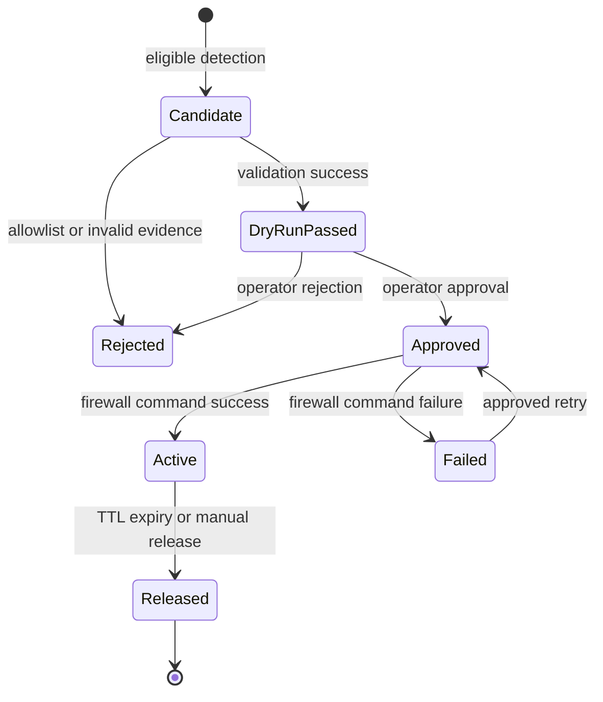

# 방화벽 대응 요구사항

| 항목 | 내용 |
|------|------|
| 상태 | 계획 |
| 단계 | 2차 개발 |
| 우선순위 | P1 |
| 현재 구현 | 없음 |
| 출처 | 2026-07-06 회의의 탐지 후 방화벽 등록 방향 |

회의에서 합의된 범위는 방화벽 등록을 다음 개발 방향에 포함하는 것까지다. dry-run, 승인, TTL, 감사 로그는 안전한 운영을 위해 이 문서가 제안하는 조건이며 다음 회의에서 확정해야 한다.

## 목표

신뢰할 수 있는 보안 탐지를 방화벽 차단 후보로 전환하고, 운영자가 결과를 확인·승인·해제할 수 있게 한다. 오탐이나 공유 IP 차단이 서비스 장애로 확대되지 않도록 초기에는 dry-run과 승인형 흐름을 사용한다.

## 범위

- 브루트포스, DDoS, 민감 경로 접근에서 나온 `clientIp`의 차단 후보화
- allowlist와 정책 검증
- dry-run, 관리자 승인, 방화벽 등록, 해제, 감사 로그
- 중복 요청과 실행 실패 처리

4xx·5xx 비율 기반 서비스 오류는 그 자체로 외부 IP 자동 차단 근거로 사용하지 않는다.

## 요구사항

| ID | 요구사항 | 상태 |
|----|----------|------|
| REQ-FW-001 | 자동 대응 가능한 탐지 유형과 최소 증거·임계값을 정책으로 명시해야 한다. | 결정 대기 |
| REQ-FW-002 | 신뢰 IP, 내부 IP, 자체 서버 IP, 운영자 지정 IP를 allowlist로 관리하고 차단 전에 검사해야 한다. | 계획 |
| REQ-FW-003 | 차단 전에 IP 형식, IP 버전, 공유/NAT 가능성, 현재 차단 상태를 검증해야 한다. | 계획 |
| REQ-FW-004 | 같은 사건 또는 IP에 대해 같은 방화벽 규칙을 중복 생성하지 않아야 한다. | 계획 |
| REQ-FW-005 | 최초 운영은 dry-run을 지원하고, 실제 차단은 권한 있는 관리자의 명시적 승인을 요구해야 한다. | 계획 |
| REQ-FW-006 | 탐지 ID, IP, 대상, 사유, 요청자·승인자, 명령 결과, 생성·만료·해제 시각을 감사 로그에 남겨야 한다. | 계획 |
| REQ-FW-007 | 모든 차단은 TTL 만료 또는 관리자 조작으로 되돌릴 수 있어야 한다. | 계획 |
| REQ-FW-008 | 방화벽 호출 실패가 탐지와 알림을 중단시키지 않아야 하며 재시도 여부를 기록해야 한다. | 계획 |
| REQ-FW-009 | 방화벽 연동 계정은 필요한 명령만 수행하는 최소 권한을 가져야 하고 비밀정보를 로그에 남기지 않아야 한다. | 계획 |

## 권장 상태 흐름

## 수용 기준

| ID | 시나리오 | 기대 결과 |
|----|----------|-----------|
| AC-FW-001 | allowlist IP가 탐지 임계값 충족 | 차단 후보가 거절되고 이유가 기록됨 |
| AC-FW-002 | 같은 IP 차단 요청이 반복됨 | 방화벽 규칙은 한 번만 생성되고 기존 상태를 반환 |
| AC-FW-003 | 방화벽 명령 실패 | 탐지 메일은 정상 발송되고 실패와 재시도 가능 여부가 기록됨 |
| AC-FW-004 | TTL 만료 또는 관리자 해제 | 규칙이 제거되고 생성부터 해제까지 감사 추적 가능 |
| AC-FW-005 | 승인 권한 없는 사용자가 실행 요청 | 방화벽 변경 없이 403 또는 동등한 거부 결과 반환 |

## 착수 전 결정 사항

- 대상 방화벽 제품과 CLI/API 계약
- 실행 호스트와 서비스 계정 권한
- IPv4·IPv6 지원 범위
- NAT·공유 IP 처리와 차단 임계값
- 차단 TTL, 재탐지 시 연장 정책, 긴급 해제 절차
- 승인 역할과 2인 승인 필요 여부
